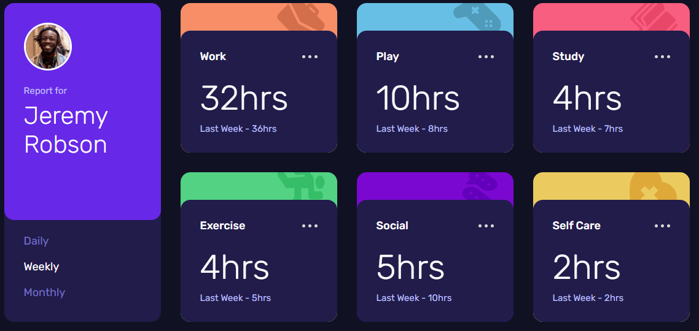
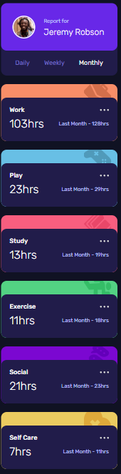

# ⏱️ Time-Tracking Dashboard

Panel interactivo inspirado en el reto **Frontend Mentor – Time Tracking Dashboard**.  
Permite visualizar el tiempo dedicado a distintas actividades y conmutar entre las vistas **diaria, semanal y mensual** obteniendo los datos de un archivo `data.json`.

---

## 📸 Capturas de pantalla

| Escritorio | Móvil |
|------------|-------|
|  |  |

---

## 🛠️ Tecnologías utilizadas

| Herramienta | Propósito |
|-------------|-----------|
| **HTML5** | Estructura semántica |
| **SCSS / CSS** | Maquetado responsive, variables y mixins |
| **JavaScript ES6** | Fetch de datos y actualización dinámica del DOM |
| **JSON** | Fuente de datos (`assets/data/data.json`) |

---

💪 Retos enfrentados
Estado global sin frameworks – Mantener sincronizadas todas las tarjetas al cambiar el periodo (Daily / Weekly / Monthly).

Arquitectura de estilos – Organización BEM + SCSS para evitar cascadas indeseadas y facilitar la escalabilidad.

Responsive design – Uso combinado de CSS Grid y Flexbox para adaptarse de 320 px a 1440 px.

Accesibilidad – Roles ARIA y contraste de colores para cumplir buenas prácticas.

🎓 Principales aprendizajes
Patrón fetch → render con datos externos en formato JSON.

Variables, mixins y partials en SCSS para reutilización y coherencia de diseño.

Unidades relativas para mejorar la legibilidad en múltiples resoluciones.

Flujo de trabajo ligero: solo HTML, SCSS y JS vanilla.

